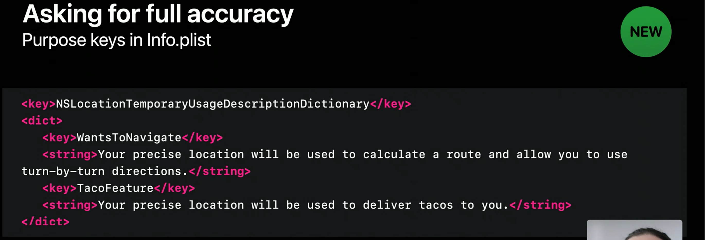

# What's in new location

- iOS 13 때 부터 위치 권한에 대한 옵션이 3가지가 되었고, 사용자는 위치 프롬프트에 응답하거나 설정으로 이동하여 이러한 옵션 중 하나를 설정할 수 있습니다. 즉, 앱이 즉시 위치 정보를 얻을 수 있습니다

- 사용자 개인 정보 보호가 Apple의 주요 우선 순위이기 때문에 우리는 다음과 같이 생각했습니다. 

  - 민감한 위치 정보에 대한 액세스를 규제 할 수 있도록 사용자에게 제공 할 수 있는 방법이 존재하는가
  - 해당 어플에서 민감한 위치 정보가 필요한것인가에 대한 의문이 존재

  - 대안 : 굳이 정확한 위치를 제공해야하는게 아니라면 대략적인 위치정보를 선택할 수 있는 옵션 
    - 데이팅, 이벤트 어플의 경우 민감한 정보를 활용하여 좋은 기능을 만들 수 있으나, 대다수는 원하지 않지만 현재는 위치정보를 허용할 수 밖에없다.

### iOS 14


- **Precise 옵션**을 사용하면 사용자가 정확한 위치가 아닌 대략적인 위치 만 앱에 부여 할 수 있습니다.
  설정에서 사용자에게도 표시됩니다.
- 유저가 앱내에서 위치정보에 대하여 결정할 두가지 방향
  - **What Circumstances**
  -  **How Much** 
- iOS 14에서 Precise 에 대하여 기본값을 설정할 수 없음. 반드시 유저에게 값을 받아야함

### Adopting Accuracy Authorization

- **인증 상태**


- **위치 정확도**


> **reducedAccuracy** iOS 14에서 추가된 옵션

- **추가된 AccurarcyAuthorization에 따라서 DelegateMethod도 수정됨**


```
reducedAccuracy은 이전과 마찬가지로 didUpdateLocations 델리게이트에 계속 전달됩니다.
그리고 여전히 CLLocationCoordinate2D 중심점과 수평 정확도에 대한 큰 값이있는 CLLocation 객체로 표현됩니다.
이러한 위치는 시간당 약 4 번 재 계산됩니다.
따라서 애플리케이션에 시간 초과 로직이있는 경우 fullAccuracy 를 사용해야함
```

### 적용 사례


- **reducedAccuracy**
  -  넓은 파란 원 안에 실제로 존재하는 위치가 포함되어있고, 상단에 `Precise` 옵션 Off 상태를 알려주어 정확도가 낮다는것을 표현

- 네비게이션 앱에서 정확도 수정이 필요하다면

  - 설정으로 이동시켜 값을 수정을 유도
  - 일시적으로 fullAccuracy옵션을 사용할 수 있도록 허용

  
  - **PurposeKey**

  

- 사용자에게 필요할때만 fullAccuracy옵션을 요구하여 불필요한 정보에 대하여 당당 해질 수 있다.


### Background Location update


- 도착한 시간은 동일하지만 정확도에 따라 결과가 다름
- Beacon and other regions monitoring is disabled under .reducedAccuracy


### Reduced accuracy by default


- **info.plist 설정**


### Desired Accuracy 

```swift
var desiredAccuracy: CLLocationAccuracy { get set }
```

- 앱에서 수신하려는 위치 데이터의 정확성입니다.

```
desiredAccuracy는 필요한만큼의 정확도 만 사용하도록 권장하기 위해 도입 한 속성입니다. 여기에는 여러 가지 이유가 있지만 가장 중요한 것은 iOS가 배터리 수명을 절약하도록 허용하는 것이 었습니다. 자, 이것은 두 가지 측면에서 현재의 ReduceAccuracy와는 다릅니다. 
첫째, GPS 신호가 부족하거나 동시에 실행중인 다른 앱이있을 수 있기 때문에 원하는 정확도를 얻을 수 있다는 보장이 없었습니다. 둘째,이 정보를 사용자에게 표시하는 효과적인 방법이 없었습니다.
그것은 사용자가 앱이 얻을 수있는 정보의 양을 제어 할 수 없다는 것입니다.
```

### How's it work


- 정확도가 낮은 위치는 소음이 추가 된 실제 위치가 아니라 양자화 된 정보임

- 위치정보 업데이트가 작동하는 방식은 위치가 대략 몇 킬로미터 크기의 섹터로 "양자화"된다는 것입니다. 이동할때 마다 실시간으로 업데이트 되지 않고, 다른 섹터로 넘어갈 때만 작동합니다.  (더 밀집된 도시 지역에서는 더 작습니다)
- 도시,나라 경계선을 고려

### App Clips

- 앱 클립은 **always authorization** 권한을 얻을 수 없다
- 앱 클립에서 사용하는 위치권한은 **일시적임**


### Widget Kit

- 위치를 사용하는 위젯을 만들 때 **info.plist**에 **NSWidgetWantsLocation을** 포함해야함
- 위젯에서는 인증 프롬프트를 표시할 수 없기 때문에 상위 앱에서 설정된 권한을 따름